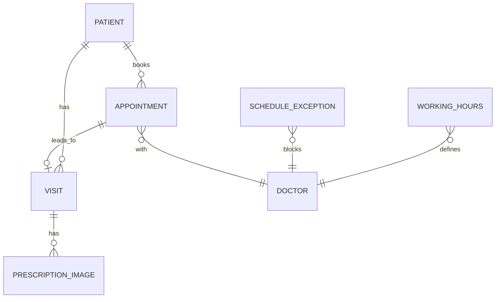
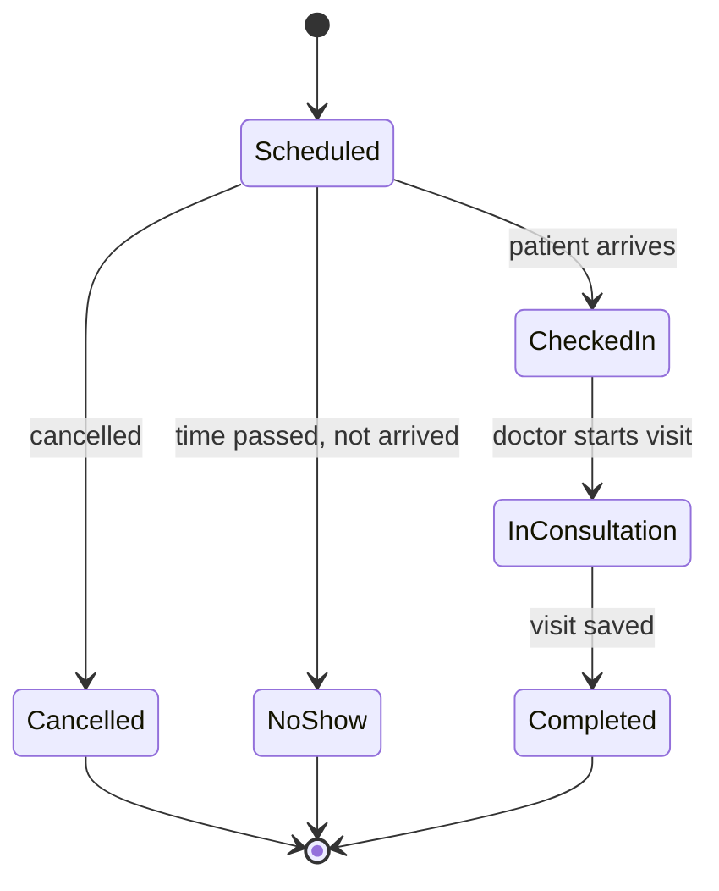

# Patient Management System — Spec

2026-09-20 · @Someone

## Overview

A single-doctor clinic web app that stores patient profiles, books appointments against the doctor's schedule, and records each visit's notes and prescription.

**Goals**

- Register and find patients in under 30 seconds.
- Book, reschedule and cancel appointments with no double-booking.
- Keep a permanent, searchable history of visits and prescriptions per patient.
- Store an image of each visit's prescription against that visit.

**Non-goals (v1)**

- Billing and insurance claims
- Pharmacy or inventory management
- Lab integrations and imaging
- Multi-doctor or multi-branch support (design so it can be added later)

## Users and roles

There is one role, Admin, with a single login. The admin does all the work; patients do not log in.

| Role | Can do |
| --- | --- |
| Admin | Everything: manage patient profiles, working hours and leave, book, reschedule and cancel appointments, check patients in, record visits, and upload prescription images |

## Functional requirements

### 1. Patient profiles

- Create, edit, search and archive patients (no hard delete).
- Fields: auto-generated patient ID, full name, date of birth, sex, phone (required), email, address, emergency contact, blood group, allergies, chronic conditions, notes.
- Search by name, phone or patient ID; warn on possible duplicates (same phone + similar name).
- Profile page shows demographics, upcoming appointments and a visit timeline.

### 2. Doctor schedule and availability

- Weekly working hours per weekday, with one or more blocks per day (e.g. Mon 10:00–13:00 and 17:00–20:00).
- Slots are fixed at 12 minutes, which gives 5 patients per hour; the slot length stays changeable in settings.
- Exceptions: full-day leave, partial-day blocks, holidays, and extra one-off working hours.
- Blocking a time that already has appointments lists them and asks the admin to reschedule or cancel them first.

### 3. Appointments

- The admin books by choosing a patient, a date and a free slot; the system only offers slots inside working hours that are not blocked or taken.
- One appointment per slot; a database constraint prevents double-booking even if two people book at once.
- Fields: patient, start time, duration, reason, type (new, follow-up), status, booked-by, notes.
- Statuses: Scheduled, Checked-in, In consultation, Completed, Cancelled, No-show.
- Reschedule and cancel with an optional reason; keep the change history.
- Day view: today's queue with check-in button.
- Walk-ins: create an appointment for the next free slot, or a same-day extra slot that the doctor allows.
- Optional SMS or WhatsApp reminder the day before (phase 2).

### 4. Visits and prescriptions

- Starting a consultation from an appointment creates a visit record (a walk-in can create one directly).
- Visit fields: chief complaint, vitals (BP, pulse, temperature, weight, SpO2), examination notes, diagnosis, advice, follow-up date.
- The prescription is saved only as an image: the admin uploads a photo or scan of the signed paper prescription, or captures it with the device camera. No medicine lines are typed or stored as data.
- A visit can hold one or more prescription images (JPG or PNG, up to 10 MB each, compressed on upload).
- Images open full-screen with zoom and can be printed from the visit page; the patient's visit timeline shows a thumbnail for each.
- After a visit is completed, images cannot be deleted or replaced; a correction is added as a new image and the old one stays.

## Data model

Seven core tables in a relational database (PostgreSQL recommended). All tables carry created\_at, updated\_at and created\_by.

| Table | Key fields |
| --- | --- |
| user | id, name, email, password hash, active |
| patient | id, patient\_no, name, dob, sex, phone, email, address, emergency contact, blood group, allergies, conditions, notes, archived |
| working\_hours | weekday (0–6), start\_time, end\_time, slot\_minutes |
| schedule\_exception | date, start\_time, end\_time, type (leave, holiday, extra hours), reason |
| appointment | id, patient\_id, start\_at, end\_at, type, reason, status, cancel\_reason, booked\_by |
| visit | id, patient\_id, appointment\_id (nullable), visit\_at, complaint, vitals (JSON), examination, diagnosis, advice, follow\_up\_date, status (open or completed) |
| prescription\_image | id, visit\_id, file\_path, mime\_type, size\_bytes, uploaded\_by, uploaded\_at |

An audit\_log table records who viewed or changed a patient, visit or prescription, and when. Store all times in UTC and display them in the clinic's timezone (Asia/Kolkata by default).

## Workflows and business rules

An appointment moves through these states:

**Slot availability** = working hours for that weekday, plus extra-hours exceptions, minus leave and blocked times, minus existing non-cancelled appointments, minus slots in the past.

**Rules**

1. No two active appointments may overlap (enforced in the database, not only the UI).
2. Cancelling or marking no-show frees the slot immediately.
3. Appointments can be booked up to 90 days ahead (configurable) and cancelled up to the start time.
4. A visit is completed by the admin; completed visits are locked, and prescription images cannot be deleted (corrections are added as new images).
5. Patients with recorded allergies show a warning banner on every visit screen.
6. Patient records are archived, never deleted.

## MVP scope and open questions

The MVP covers the three things you asked for: patient profiles, scheduling, and visit prescriptions.

| Phase | Scope |
| --- | --- |
| 1 (MVP) | Admin login, patient profiles, working hours and leave, appointment booking and day view, visit notes, prescription image upload and viewing |
| 2 | SMS or WhatsApp reminders, reports (daily visits, no-show rate), file attachments such as lab reports |
| 3 | Billing, multi-doctor support |

**Open questions**

- [ ] What are the doctor's working hours for each weekday?
- [ ] Is the admin the doctor or a separate staff member?
- [ ] Cloud hosting or an on-premise server at the hospital?
- [ ] Should the app interface support Hindi or a regional language as well as English?
